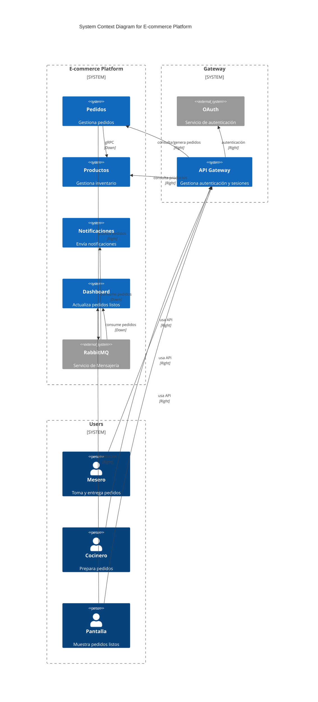

# TPI_IntegracionAplicaciones

```mermaid
C4Context
    title System Context Diagram for E-commerce Platform

   
 %% E-commerce a la derecha
    System_Boundary(ecommerce, "E-commerce Platform") {
        System(pedidosSystem, "Pedidos", "Gestiona pedidos")
        System(productosSystem, "Productos", "Gestiona inventario")
        System(notificationSystem, "Notificaciones", "Envía notificaciones")
        System(dashboardSystem, "Dashboard", "Actualiza pedidos listos")
        System_Ext(rabbitMQ, "RabbitMQ","Servicio de Mensajería")
    }

    %% Relaciones Users -> Gateway
    Rel(user1, apiGateway, "usa API", "Right")
    Rel(user2, apiGateway, "usa API", "Right")
    Rel(user3, apiGateway, "usa API", "Right")
    Rel(user3, dashboardSystem, "webSocket", "Right")

    %% Relaciones Gateway -> E-commerce (horizontal)
    Rel(apiGateway, pedidosSystem, "consulta/genera pedidos", "Right")
    Rel(apiGateway, productosSystem, "consulta productos", "Right")

    %% Relaciones E-commerce internas
    Rel(pedidosSystem, productosSystem, "gRPC", "Down")
    Rel(pedidosSystem, rabbitMQ, "publica pedidos", "Right")
    Rel(rabbitMQ, dashboardSystem, "consume pedidos", "Down")
    Rel(rabbitMQ, notificationSystem, "consume pedidos", "Down")

    %% Gateway en el centro
    System_Boundary(gateway, "Gateway") {
        System_Ext(OAuth, "OAuth", "Servicio de autenticación")
        System(apiGateway, "API Gateway", "Gestiona autenticación y sesiones")
        
        Rel(apiGateway, OAuth, "autenticación", "Right")
    }

     %% Users a la izquierda
    System_Boundary(usersBoundary, "Users") {
        Person(user1, "Mesero","Toma y entrega pedidos")
        Person(user2, "Cocinero", "Prepara pedidos")
        Person(user3, "Pantalla", "Muestra pedidos listos")
    }

   
```
